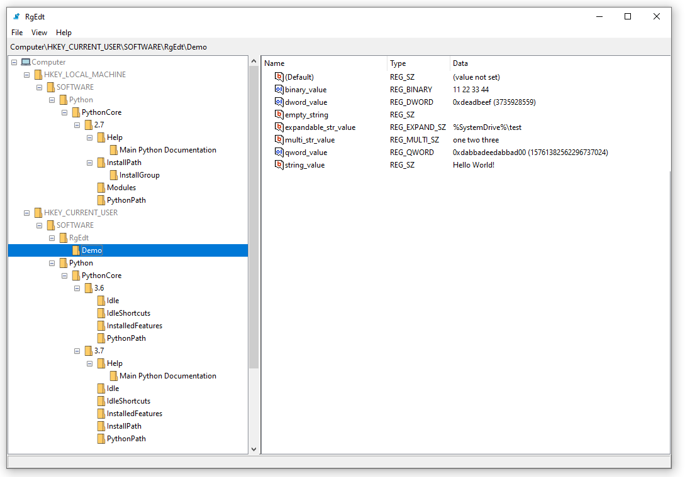
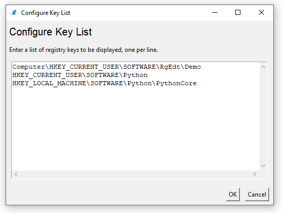
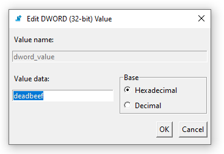

# RgEdt

## Overview
RgEdt is a basic UI allowing to view and edit a selected subset of the Windows Registry.

This program offers a basic user interface (essentially, a stripped-down `regedit`) 
which can be used to view and edit a subset of the Windows Registry.
It is useful for users who frequently work with a small subset of keys,
scattered in distant locations throughout the registry.
The program filters out all keys which aren't included in the list of requested
keys, allowing users to view just the keys relevant for them.

## Screenshots

Main Window:

Key List:

Edit Dialog:

## Dependencies

* Python 3.8+ with tkinter

## Future Development

* Sort the key list
* Remember the last key accessed between sessions
* Support all registry value types for the "edit" menu
* Add an "open in regedit" option
* Automated tests for UI
* Interactive address bar allowing to jump to key path
* Export tree to XML
* Right click menu for key tree
* Logging

## License

Released under MIT License.